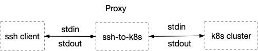

A simple proxy server. from **ssh client** login to [k8s](https://kubernetes.io/) **container**.
this project it not production ready and not have the full features, hope inspire you do more things.

## Description

The workflow like below, it start a ssh server for ssh connection and forward it to k8s.



## QuickStart

1. install
```shell script
go get github.com/henryhtl/ssh-to-k8s
```
or
```shell script
git clone github.com/henryhtl/ssh-to-k8s $GOPATH/src/github.com/henryhtl
```

2. build
```shell script
cd $GOPATH/src/github.com/henryhtl
go build -o ssh-to-k8s main.go
```

3. run
```shell script
# must spcefic the kubernetes config file(or default ~/.kube/config)
./ssh-to-k8s -h   # show help msg
```

4. connect to k8s

```shell script
ssh -o "UserKnownHostsFile /dev/null" 127.0.0.1 -p 2222

# flow the prompt enter <namespace> <pod> <container>
```

## Acknowledgments
inspired by [Dashboard](https://github.com/kubernetes/dashboard) and [koko](https://github.com/jumpserver/koko)